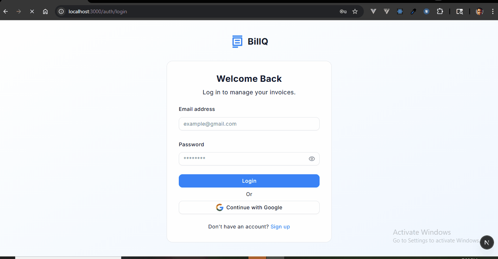
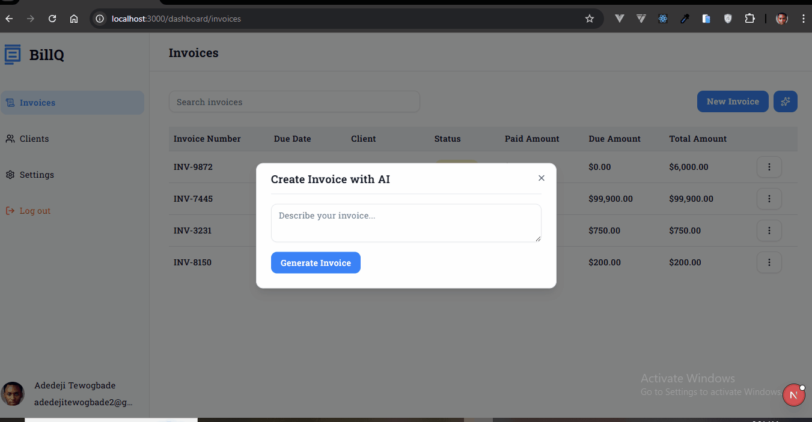
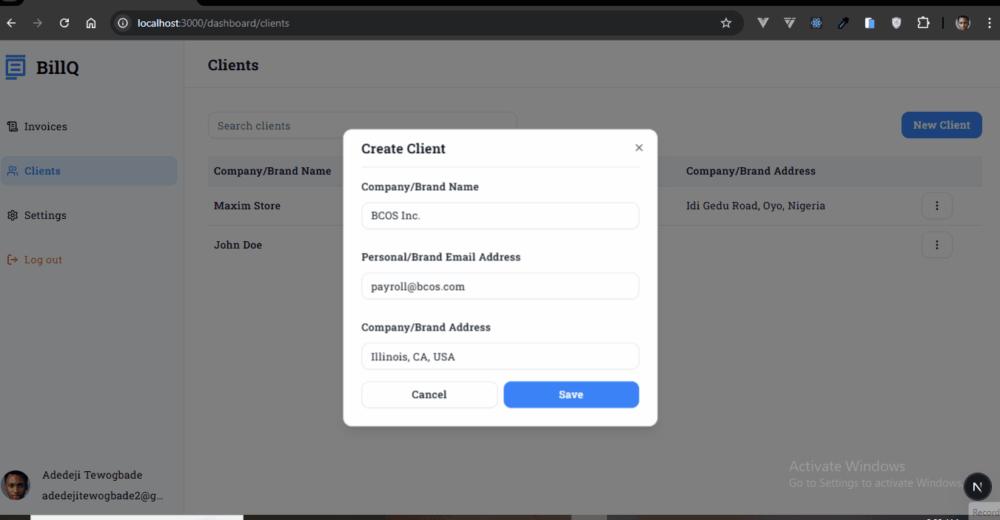

# 🧾 BillQ

A modern, intelligent invoicing web app for freelancers and small businesses — designed to make invoice creation, tracking, and payments seamless.

Built with **Next.js 15**, **TypeScript**, **Tailwind CSS**, **shadcn/ui**, **NextAuth**, and **Prisma (MongoDB)**.

**Live Demo:** [https://billq.vercel.app]

---

## 📸 Screenshots


| Dashboard & Overview | Create Invoice with AI | Create Client |
| :---: | :---: | :---: |
|  |  |  |

## 🚀 Features Implemented

### 🔐 Authentication

- Email/password authentication using **NextAuth**.
- Session management integrated with Prisma user model.
- User profile and company info stored in MongoDB.

### 🧾 Invoices

- **Invoice CRUD:** Create, view, and edit invoices.
- **Invoice Preview Page:** Responsive layout with itemized details, client info, and summary totals.
- **Download as PDF:** Users can download invoice previews as a PDF using a custom `printPDF()` utility.
- **Public Invoice Page (SSR):**
  - Fully **server-rendered** for SEO and OG tags.
  - Dynamically generates metadata (`title`, `og:title`, and description) from invoice data.
  - Fetches user and client information directly from the database via Prisma.

### 💰 Clients

- Each invoice is linked to a specific client.
- Client details (name, email, address) are rendered dynamically.

### 💾 Database Schema

Using **Prisma ORM** with a **MongoDB** adapter.
Main models include:

- `User`
- `Client`
- `Invoice`
- `InvoiceItem`
- `Payment`

## 🚀 Getting Started

To get a local copy up and running, follow these simple steps.

### Prerequisites

- Node.js (v22)
- npm or yarn

### Installation

1.  **Clone the repository:**
    ```sh
    git clone https://github.com/devadedeji/billq.git
    ```
2.  **Navigate to the project directory:**
    ```sh
    cd billq
    ```
3.  **Install NPM packages:**
    ```sh
    npm install
    ```

### Environment Variables

1.  Create a `.env.local` file in the root of the project.
2.  Add your configuration variables.

    ```env
    # .env.local
    DATABASE_URL="
    GEMINI_API_KEY=""
    NEXTAUTH_SECRET=""
    GOOGLE_CLIENT_ID=""
    GOOGLE_CLIENT_SECRET="""
    VERCEL_TOKEN=""
    STRIPE_PUBLIC_KEY=""
    STRIPE_SECRET_KEY=""
    NEXT_PUBLIC_APP_URL=http://localhost:3000
    ```

### Running the Application

Start the development server:

```sh
npm run dev
```

Open http://localhost:3000 to view it in the browser.

### Running Tests

This project uses **Vitest** for unit and component tests, and **Playwright** for end-to-end (E2E) tests.

To run the component and integration tests, use the following command:

```sh
npm run test:all
```
